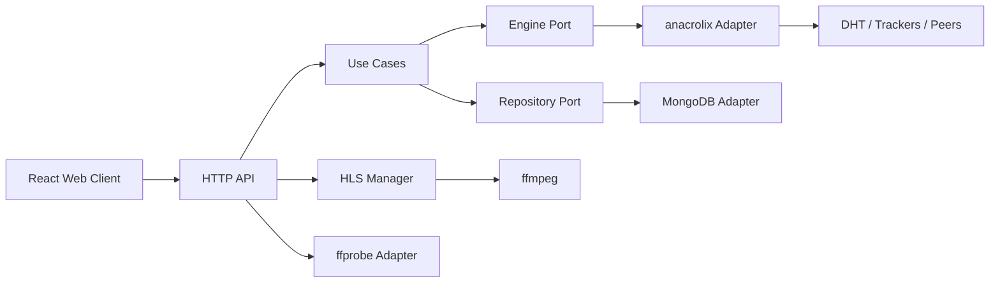

# Architecture

## Scope
The service ingests torrent sources (`magnet` or `.torrent`), stores torrent metadata in MongoDB, manages runtime sessions via anacrolix, and serves media using:
- direct byte-range streaming (`/torrents/{id}/stream`)
- HLS transcoding (`/torrents/{id}/hls/...`)
- media track probing for audio/subtitle selection (`/torrents/{id}/media/{fileIndex}`)

The project includes:
- Go backend (`services/torrent-engine/cmd/server`, `services/torrent-engine/internal/*`)
- React frontend (`frontend`)
- Go microservice for search (`services/torrent-search`)

## Clean Architecture Boundaries
- Domain: `services/torrent-engine/internal/domain`
- Ports: `services/torrent-engine/internal/domain/ports`
- Use-cases: `services/torrent-engine/internal/usecase`
- Inbound adapters: `services/torrent-engine/internal/api/http`
- Outbound adapters:
  - torrent engine: `services/torrent-engine/internal/services/torrent/engine/anacrolix`
  - media probe: `services/torrent-engine/internal/services/torrent/engine/ffprobe`
  - repository: `services/torrent-engine/internal/repository/mongo`
  - optional memory storage: `services/torrent-engine/internal/storage/memory`

Dependency direction is inward: adapters -> use-cases -> domain.

## Runtime Components
- `services/torrent-engine/cmd/server/main.go`: composition root, config, graceful shutdown.
- `services/torrent-engine/internal/api/http/server.go`: REST routing, validation, error mapping, swagger/openapi serving.
- `services/torrent-engine/internal/api/http/hls.go`: HLS job manager + ffmpeg orchestration.
- `services/torrent-engine/internal/usecase/*`: use-case orchestration (`Create`, `Start`, `Stop`, `Delete`, `Stream`, `State`).
- `services/torrent-engine/internal/services/torrent/engine/anacrolix/*`: torrent session lifecycle and statistics.
- `services/torrent-engine/internal/services/torrent/engine/ffprobe/ffprobe.go`: ffprobe JSON parsing into `domain.MediaInfo`.
- `services/torrent-engine/internal/repository/mongo/repository.go`: Mongo CRUD and listing.
- `frontend/src/*`: UI, polling, playback controls, track selector.

## Component Diagram


## Playback Pipeline
1. Frontend selects torrent file.
2. Frontend requests `GET /torrents/{id}/media/{fileIndex}` to read available audio/subtitle tracks.
3. Frontend chooses playback mode:
4. `direct` for browser-native formats and default tracks.
5. `HLS` for unsupported formats or explicit audio/subtitle track selection.
6. HLS endpoint starts/reuses a job keyed by `(torrentID, fileIndex, audioTrack, subtitleTrack)`.
7. ffmpeg transcodes and exposes `index.m3u8` + `seg-xxxxx.ts`.
8. Browser requests playlist/segments via native HLS (Safari) or `hls.js`.

## Session Recovery
Engine sessions are in-memory. Mongo records persist across restart.

When runtime session is missing:
- `StartTorrent` and `StreamTorrent` restore session from persisted `record.Source`.
- if source is missing in an old record, API returns `404 not_found`.

## Error Model
All failures map to a normalized envelope:
```json
{
  "error": {
    "code": "engine_error",
    "message": "engine error details"
  }
}
```

Main error codes:
- `invalid_request`
- `not_found`
- `engine_error`
- `repository_error`
- `internal_error`
- `stream_unavailable`

## Sequence References
- Use-case map: `services/torrent-engine/docs/diagrams/use-case.puml`
- Frontend playback: `services/torrent-engine/docs/diagrams/frontend-playback.puml`
- HLS playlist flow: `services/torrent-engine/docs/diagrams/uc-hls-playlist.puml`
- Media track selection flow: `services/torrent-engine/docs/diagrams/uc-media-info.puml`
